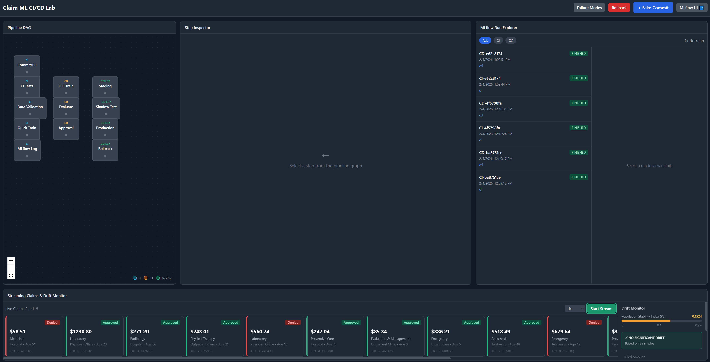

# Claim ML CI/CD Lab

An enterprise CI/CD simulation for medical claim ML pipelines with real MLflow tracking.



## Background: Why This Simulation Exists

This project was created as a **hands-on educational lab** to teach the complete lifecycle of ML engineering in an enterprise environment. Many data scientists are familiar with model training in notebooks, but struggle to understand how ML models actually get deployed in production.

### The Problem It Solves

In enterprise IT departments (like healthcare/medical claims), deploying ML models involves:

- **CI/CD Pipelines**: Automated testing, validation, and deployment gates
- **Experiment Tracking**: Logging every training run for reproducibility and auditability
- **Champion vs Challenger**: Safe model promotion with automatic comparison
- **Rollback Capability**: Quick recovery when new models underperform
- **Drift Monitoring**: Detecting when production data diverges from training data

Learning these concepts by reading documentation is insufficient—you need to **see and interact** with a real pipeline.

### What This Lab Teaches

| Concept | How This Lab Demonstrates It |
|---------|------------------------------|
| **CI vs CD** | CI = quick validation on every commit; CD = full training before production |
| **MLflow** | Real experiment tracking with params, metrics, artifacts, and model registry |
| **Quality Gates** | Data validation, champion comparison, and manual approval steps |
| **Reproducibility** | Every run is tagged with `commit_sha`, `seed`, and `dataset_window` |
| **Model Promotion** | Challenger model must beat champion before deployment |
| **Shadow Testing** | Run new models on live traffic without affecting predictions |
| **Rollback** | One-click revert to previous production model |

### Why Synthetic Data?

We use synthetic medical claims (non-PHI) because:

1. **No compliance risk**: No HIPAA/PHI concerns for learning environments
2. **Reproducible**: Deterministic seeding ensures identical results
3. **Realistic patterns**: Approval probability based on feature combinations mimics real-world patterns
4. **Safe to share**: Can be used in demos, training, and open-source repositories

### Real-World Tools vs This Simulation

This simulation teaches concepts that apply to many production tools. Here's where you'd do each step in real enterprise environments:

| Stage | This Simulation | Real-World Tools |
|-------|-----------------|------------------|
| **CI Pipeline** | FastAPI pipeline engine | **GitHub Actions**, **GitLab CI**, **Jenkins**, **Azure DevOps Pipelines**, **CircleCI** |
| **CD Pipeline** | FastAPI pipeline engine | Same as CI, or **Argo Workflows**, **Kubeflow Pipelines**, **AWS Step Functions** |
| **Experiment Tracking** | MLflow (real!) | **MLflow**, **Weights & Biases**, **Neptune.ai**, **Comet ML**, **SageMaker Experiments** |
| **Model Registry** | MLflow Model Registry | **MLflow**, **SageMaker Model Registry**, **Vertex AI Model Registry**, **Azure ML** |
| **Model Deployment** | Simulated local pointer | **SageMaker Endpoints**, **Vertex AI**, **Azure ML**, **Kubernetes + KServe**, **Databricks Model Serving** |
| **Feature Store** | Synthetic generator | **Feast**, **Databricks Feature Store**, **SageMaker Feature Store**, **Tecton** |
| **Drift Monitoring** | PSI calculation | **Evidently AI**, **WhyLabs**, **Arize AI**, **Fiddler**, **SageMaker Model Monitor** |
| **Approval Gates** | UI button | **GitHub PR reviews**, **Slack/Teams approvals**, **ServiceNow**, **PagerDuty** |
| **Artifact Storage** | MinIO (S3-compatible) | **AWS S3**, **GCS**, **Azure Blob**, **MinIO** |

#### Common Enterprise MLOps Stacks

**AWS Stack:**
```
GitHub Actions → SageMaker Pipelines → MLflow/SageMaker → SageMaker Endpoints → CloudWatch
```

**GCP Stack:**
```
Cloud Build → Vertex AI Pipelines → Vertex AI Experiments → Vertex AI Endpoints → Cloud Monitoring
```

**Azure Stack:**
```
Azure DevOps → Azure ML Pipelines → Azure ML → Azure ML Endpoints → Azure Monitor
```

**Open Source Stack:**
```
GitHub Actions → Kubeflow Pipelines → MLflow → KServe/Seldon → Prometheus/Grafana
```

**Databricks Stack:**
```
Databricks Repos → Databricks Workflows → MLflow → Databricks Model Serving → Lakehouse Monitoring
```

> **Note**: This simulation uses MLflow for real (not simulated), so you're already learning one of the most widely-adopted experiment tracking tools in the industry!

### What's Real vs Simulated in This Project

| Component | Status | What It Does Here | Real-World Equivalent |
|-----------|--------|-------------------|----------------------|
| **MLflow Tracking** | ✅ **REAL** | Logs experiments, params, metrics, artifacts | Same (MLflow, W&B, Neptune) |
| **MLflow Model Registry** | ✅ **REAL** | Registers and versions trained models | Same (MLflow, SageMaker, Vertex AI) |
| **PostgreSQL** | ✅ **REAL** | Stores MLflow metadata | Same (PostgreSQL, MySQL, cloud DBs) |
| **MinIO Artifacts** | ✅ **REAL** | S3-compatible storage for model files & plots | AWS S3, GCS, Azure Blob |
| **scikit-learn Training** | ✅ **REAL** | Trains actual Random Forest models | Same (scikit-learn, XGBoost, PyTorch) |
| **SHAP Analysis** | ✅ **REAL** | Generates real feature importance explanations | Same (SHAP, LIME) |
| **Docker Compose** | ✅ **REAL** | Orchestrates all services locally | Kubernetes, ECS, Cloud Run |
| **WebSocket Logs** | ✅ **REAL** | Streams real-time logs to browser | Same (WebSockets, Server-Sent Events) |
| **Git Commits** | 🔶 **SIMULATED** | "Fake Commit" button generates SHA | Real git commits trigger CI via webhooks |
| **CI/CD Orchestration** | 🔶 **SIMULATED** | FastAPI runs steps sequentially | GitHub Actions, Jenkins, GitLab CI |
| **Deployment** | 🔶 **SIMULATED** | Updates a database pointer | SageMaker Endpoints, Kubernetes, API Gateway |
| **Production API** | 🔶 **SIMULATED** | No real inference endpoint | REST/gRPC model serving (KServe, TF Serving) |
| **Shadow Scoring** | 🔶 **SIMULATED** | Logs metrics but doesn't serve real traffic | A/B testing frameworks, shadow deployments |
| **Approval Workflow** | 🔶 **SIMULATED** | UI button click | GitHub PR reviews, Slack approvals, ServiceNow |
| **Claims Data** | 🔶 **SIMULATED** | Synthetic generator (no PHI) | Real claims from data warehouse |

#### What You're Actually Learning (Real Skills)

Even though some parts are simulated, you're building **real skills**:

| Skill | How This Lab Teaches It |
|-------|------------------------|
| **MLflow API** | You interact with a real MLflow server—same API used in production |
| **Experiment Design** | Real params, metrics, and artifact logging |
| **Model Comparison** | Real champion vs challenger evaluation logic |
| **Reproducibility** | Real seed-based deterministic training |
| **Docker/DevOps** | Real containerized services with networking |
| **Pipeline Thinking** | Real understanding of CI → CD → Deploy flow |
| **Monitoring Concepts** | Real PSI drift calculation, real metric tracking |

> **Bottom Line**: The "simulation" is primarily in the **orchestration trigger** (fake commits instead of real git) and **deployment target** (database pointer instead of cloud endpoint). Everything else—training, tracking, evaluation, artifacts—is production-grade.

## Features

- **Interactive Pipeline DAG**: Visual representation of CI/CD stages with real-time status updates
- **Step Inspector**: View actual code, configuration, logs, and outputs for each step
- **Real MLflow Integration**: Experiment tracking, model registry, and artifact storage
- **Synthetic Claims Stream**: Live data feed with drift monitoring
- **Champion vs Challenger**: Model promotion logic with evaluation gates
- **Failure Mode Toggles**: Simulate various failure scenarios for testing
- **Shadow/A-B Testing**: Monitor model performance on live traffic

## Architecture

```
┌─────────────────────────────────────────────────────────────────┐
│                         Frontend (Next.js)                       │
│  ┌─────────────┐  ┌─────────────┐  ┌─────────────┐              │
│  │ Pipeline    │  │   Step      │  │   MLflow    │              │
│  │ Graph       │  │ Inspector   │  │  Explorer   │              │
│  └─────────────┘  └─────────────┘  └─────────────┘              │
│  ┌──────────────────────────────────────────────────┐           │
│  │              Claims Stream & Drift Monitor        │           │
│  └──────────────────────────────────────────────────┘           │
└─────────────────────────────────────────────────────────────────┘
                              │ REST/WebSocket
                              ▼
┌─────────────────────────────────────────────────────────────────┐
│                       Backend (FastAPI)                          │
│  ┌─────────────┐  ┌─────────────┐  ┌─────────────┐              │
│  │  Pipeline   │  │    ML       │  │   MLflow    │              │
│  │  Engine     │  │  Scripts    │  │   Client    │              │
│  └─────────────┘  └─────────────┘  └─────────────┘              │
└─────────────────────────────────────────────────────────────────┘
                              │
          ┌───────────────────┼───────────────────┐
          ▼                   ▼                   ▼
┌─────────────────┐ ┌─────────────────┐ ┌─────────────────┐
│   PostgreSQL    │ │     MLflow      │ │     MinIO       │
│  (Backend DB)   │ │    Server       │ │  (Artifacts)    │
└─────────────────┘ └─────────────────┘ └─────────────────┘
```

## Prerequisites

- Docker Desktop (with Docker Compose)
- At least 4GB RAM available for Docker
- Ports available: 3000, 5000, 8000, 9000, 9001, 5432

## Quick Start

1. **Setup environment** (optional - `.env` is already included):
   ```bash
   cp .env.example .env
   ```

2. **Start all services**:
   ```bash
   docker compose up --build
   ```

3. **Access the applications**:
   - **Frontend UI**: http://localhost:3001 (main application)
   - **MLflow UI**: http://localhost:5000 (experiment tracking)
   - **Backend API**: http://localhost:8000/docs (API documentation)
   - **MinIO Console**: http://localhost:9001 (artifact storage - optional)

4. **Run a pipeline**:
   - Click "Fake Commit" to simulate a new commit
   - Watch the CI pipeline execute
   - Click "Continue to CD" after CI completes
   - Approve the manual gate to proceed to deployment

## Services

| Service | Port | Description |
|---------|------|-------------|
| Frontend | 3001 | Next.js web application |
| Backend | 8000 | FastAPI REST/WebSocket server |
| MLflow | 5000 | MLflow tracking server |
| PostgreSQL | 5432 | Database for MLflow backend |
| MinIO | 9000/9001 | S3-compatible artifact storage |

## Default Credentials

| Service | Username | Password |
|---------|----------|----------|
| MinIO Console | `minioadmin` | `minioadmin123` |
| PostgreSQL | `mlflow` | `mlflow123` |

> **Note**: MinIO is used for artifact storage behind the scenes. You don't need to log into it for normal usage - it's only needed if you want to browse stored artifacts directly.

## UI Guide - Step by Step

### Understanding the Interface

The UI is divided into 4 main areas:

```
┌─────────────────┬─────────────────────┬─────────────────┐
│  Pipeline DAG   │   Step Inspector    │ MLflow Explorer │
│    (left)       │     (center)        │    (right)      │
├─────────────────┴─────────────────────┴─────────────────┤
│              Claims Stream & Drift Monitor              │
│                      (bottom)                           │
└─────────────────────────────────────────────────────────┘
```

### Step 1: Start a Pipeline Run

1. Click the **"+ Fake Commit"** button in the top-right header
2. This simulates a new git commit and automatically starts the CI pipeline
3. You'll see a new `run_id` appear in the header

### Step 2: Watch the CI Pipeline Execute

1. In the **Pipeline DAG** (left panel), watch the nodes change color:
   - Gray = Idle
   - Blue (pulsing) = Running
   - Green = Success
   - Red = Failed
2. Click on any node to inspect it in the center panel

### Step 3: Inspect a Step

When you click a pipeline node, the **Step Inspector** (center) shows 4 tabs:

| Tab | Description |
|-----|-------------|
| **Code** | The actual Python script that runs for this step |
| **Config** | YAML/JSON configuration used by the step |
| **Logs** | Real-time streaming logs while the step runs |
| **Outputs** | Metrics, artifacts, and results after completion |

### Step 4: Continue to CD Stage

1. After CI completes (all CI nodes turn green), the status shows "ci_complete"
2. Click **"Continue to CD →"** button in the header
3. The CD pipeline (Full Train → Evaluate → Approval) starts running

### Step 5: Approve or Reject Deployment

1. When the pipeline reaches the **Manual Approval** step, it pauses
2. The status shows "awaiting_approval"
3. Review the metrics in the Step Inspector (Outputs tab):
   - Challenger vs Champion model comparison
   - Improvement percentage
4. Click **"✓ Approve"** to proceed to deployment, or **"✗ Reject"** to stop

### Step 6: Monitor Deployment

After approval:
1. The model deploys to **Staging**
2. **Shadow monitoring** runs to detect drift
3. If no issues, the model promotes to **Production**

### Step 7: View MLflow Runs

In the **MLflow Explorer** (right panel):
1. Filter runs by stage: `CI`, `CD`, or `All`
2. Click on a run to see:
   - Parameters (model settings)
   - Metrics (accuracy, F1, AUC-ROC)
   - Artifacts (plots, model files)
3. Click **"MLflow UI ↗"** in the header for the full MLflow interface

### Step 8: Monitor Live Claims

In the **Claims Stream** (bottom panel):
1. Click **"Start Stream"** to begin generating synthetic claims
2. Watch claims flow in real-time (shows approved/denied)
3. The **Drift Monitor** shows:
   - PSI (Population Stability Index)
   - Current vs reference statistics
   - Drift detection alerts

### Step 9: Test Failure Scenarios

1. Click **"Failure Modes"** button in the header
2. Toggle on a failure scenario:
   - **Schema Validation**: Data validation will fail
   - **Metric Regression**: Model performs worse than champion
   - **MLflow Connection**: MLflow logging fails
   - **Training Error**: CI tests fail
3. Start a new pipeline to see how failures are handled

### Step 10: Rollback (if needed)

1. Click **"Rollback"** button in the header
2. This reverts production to the previous model version
3. Check the logs to confirm rollback success

## Pipeline Stages

### CI (Continuous Integration)
1. **Commit/PR**: Triggered on new commit
2. **CI Tests**: Unit tests, integration tests, linting
3. **Data Validation**: Schema and quality checks
4. **Quick Train**: Fast model training on sample data
5. **MLflow Log**: Log CI metrics to MLflow

### CD (Continuous Delivery)
6. **Full Train**: Complete model training
7. **Evaluate vs Champion**: Compare with production model
8. **Manual Approval**: Human gate for deployment

### Deploy
9. **Deploy Staging**: Push to staging environment
10. **Shadow Monitor**: Run shadow scoring, detect drift
11. **Promote Production**: Make model the new champion
12. **Rollback**: Revert to previous version (available anytime)

## Failure Mode Testing

Toggle failure scenarios from the UI to test error handling:

| Mode | Effect |
|------|--------|
| Schema Validation | Data validation fails on missing column |
| Metric Regression | Model performs worse than champion |
| MLflow Connection | MLflow server connection fails |
| Training Error | CI tests fail |

## API Endpoints

### Pipeline
- `POST /pipeline/start` - Start new pipeline run
- `POST /pipeline/commit` - Generate fake commit and start CI
- `GET /pipeline/{run_id}/status` - Get pipeline status
- `POST /pipeline/{run_id}/approve` - Approve manual gate
- `POST /pipeline/{run_id}/reject` - Reject manual gate
- `POST /pipeline/rollback` - Rollback to previous model

### Steps
- `GET /steps` - List all step definitions
- `GET /steps/{name}/code` - Get step source code
- `GET /steps/{name}/config` - Get step configuration

### MLflow
- `GET /mlflow/runs` - List MLflow runs
- `GET /mlflow/runs/{run_id}` - Get run details
- `GET /mlflow/champion` - Get current champion model

### Claims
- `GET /claims/generate` - Generate synthetic claims
- `POST /claims/stream/start` - Start claims stream
- `POST /claims/stream/stop` - Stop claims stream
- `GET /claims/drift` - Calculate drift metrics

### Failures
- `GET /failures` - List failure modes
- `POST /failures/{mode}/toggle` - Toggle failure mode

## WebSocket Endpoints

- `ws://localhost:8000/ws/logs/{run_id}` - Pipeline log stream
- `ws://localhost:8000/ws/claims` - Claims data stream

## Development

### Frontend Development
```bash
cd frontend
npm install
npm run dev
```

### Backend Development
```bash
cd backend
pip install -r requirements.txt
uvicorn app.main:app --reload
```

### Running Tests
```bash
# Backend tests
cd backend
pytest

# Frontend tests
cd frontend
npm test
```

## Synthetic Data

The system generates synthetic medical claims with:
- **CPT Buckets**: 10 categories (Evaluation, Surgery, Radiology, etc.)
- **Provider Types**: Hospital, Physician Office, Clinic, Urgent Care, Telehealth
- **Diagnosis Groups**: 20 categories (Cardiovascular, Respiratory, etc.)
- **Amounts**: Billed and allowed amounts with realistic distributions
- **Outcome**: Settlement prediction (Approved/Denied)

All data is synthetic and contains no PHI.

## Model Details

- **Type**: Random Forest Classifier (scikit-learn)
- **Features**: CPT bucket, provider type, billed amount, allowed amount, diagnosis group, patient age
- **Target**: Settlement outcome (binary classification)
- **Metrics**: Accuracy, F1 Score, AUC-ROC, Precision, Recall
- **Interpretability**: SHAP summary plots, feature importance

## Reproducibility

All runs include tracking tags:
- `commit_sha`: Simulated git commit
- `stage`: CI/CD/Deploy
- `dataset_window`: Data range used
- `seed`: Random seed for reproducibility
- `model_version`: Version string

## Troubleshooting

### Services not starting
```bash
# Check service logs
docker compose logs -f [service_name]

# Restart specific service
docker compose restart [service_name]
```

### Port conflicts
```bash
# Check what's using a port
netstat -tulpn | grep [port]

# Or on Windows
netstat -ano | findstr [port]
```

### Clean restart
```bash
docker compose down -v
docker compose up --build
```

### MLflow not showing runs
1. Check MLflow server is running: http://localhost:5000
2. Check backend can connect: http://localhost:8000/health
3. Verify MinIO bucket exists: http://localhost:9001

## License

MIT License - See LICENSE file for details.

## Screenshots

### Pipeline View
The main dashboard showing the pipeline DAG, step inspector, and MLflow explorer.

### MLflow Integration
Real-time experiment tracking with metrics, parameters, and artifact storage.

### Claims Stream
Live synthetic claims feed with drift monitoring.
