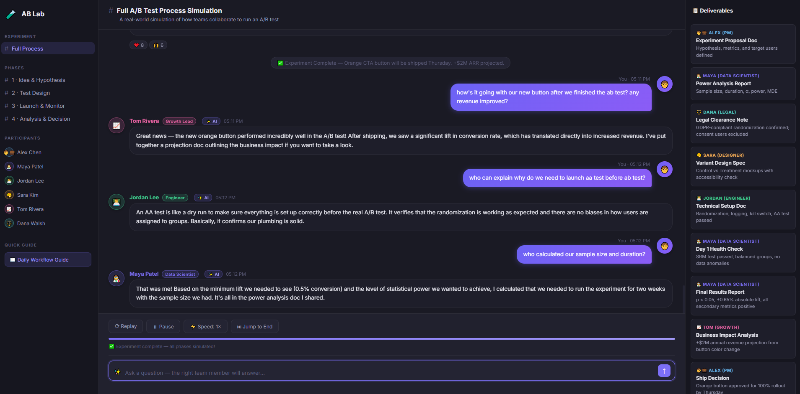

# 🧪 A/B Test Stakeholder Simulation



An interactive group chat simulation that walks through the **complete real-world A/B test process** — from idea to ship decision — as a conversation between company stakeholders.

## What It Is

A dark-mode web app that animates a fictional but realistic A/B test experiment (checkout CTA button color change) as a Slack-style group chat. Each message represents an actual conversation a real team would have, including the documents and deliverables they'd share with each other.

## Stakeholders

| Emoji | Role | Responsibilities in an A/B Test |
|---|---|---|
| 🧑‍💼 **Alex Chen** | Product Manager | Proposes hypothesis, owns ship/no-ship decision |
| 👩‍🔬 **Maya Patel** | Data Scientist | Power analysis, statistical testing, results analysis |
| 👨‍💻 **Jordan Lee** | Engineer | Implements variants, sets up tracking & feature flags |
| 🎨 **Sara Kim** | UX Designer | Designs and specs control/treatment variants |
| 📈 **Tom Rivera** | Growth Lead | Defines business MDE, interprets revenue impact |
| ⚖️ **Dana Walsh** | Legal / Privacy | GDPR compliance, consent flow review |

## The 4 Phases Simulated

```
Phase 1 — Idea & Hypothesis     →  PM spots problem, forms testable hypothesis
Phase 2 — Test Design & Setup   →  Power analysis, AA test, legal clearance, build
Phase 3 — Launch & Monitoring   →  Go live, SRM check, the "peeking problem" moment
Phase 4 — Analysis & Decision   →  Z-test results, revenue impact, ship decision
```

## Key Concepts Illustrated

- **Hypothesis writing** — what makes a valid H₀ / H₁
- **Power analysis** — how MDE, α, and power determine sample size and test duration
- **Z-test selection** — why a two-proportion Z-test is used for conversion rates
- **AA test** — validating randomization before launching the real experiment
- **The peeking problem** — why you cannot stop a test early based on interim results
- **Statistical significance** — p-value interpretation and what "reject H₀" means
- **Business impact** — connecting statistical results to revenue projections

## Getting Started

**1. Add your Gemini API key** — create a `.env` file in the project root:
```
VITE_GEMINI_API_KEY=your_key_here
```
Get a free key at [aistudio.google.com](https://aistudio.google.com/app/apikey).

**2. Install and run:**
```bash
npm install
npm run dev
```

Then open [http://localhost:5173](http://localhost:5173) in your browser.

## App Features

| Feature | Description |
|---|---|
| 🎬 Animated chat | Messages appear with typing indicators, one by one |
| 📋 Deliverables panel | Tracks every document/report shared during the process |
| ⟳ Replay | Restart the simulation from the beginning |
| ⏭ Jump to End | Skip instantly to the final state of the simulation |
| ⏸ Pause / Resume | Pause the animation at any point |
| ⚡ Speed control | Toggle 1×, 2×, or 5× playback speed |
| 📖 Workflow Guide | Plain-English 8-step daily A/B test process reference |
| 🔗 Phase navigation | Jump directly to any phase via the sidebar |
| 🤖 AI Chatbot | Ask any A/B testing question — the right stakeholder answers in character |

## Project Structure

```
ab-test-simulation/
├── index.html    # App shell and layout
├── style.css     # Dark mode UI, animations
├── data.js       # All stakeholder conversations & workflow guide
├── app.js        # Chat animation engine and interaction logic
├── llm.js        # Gemini API integration & stakeholder routing
├── .env          # Your Gemini API key (never committed)
└── package.json  # Vite dev server
```

## Learning Outcomes

After watching the full simulation, you'll understand:

1. **Who does what** in an A/B test at a tech company
2. **What documents get produced** at each phase
3. **Why statistical rigour matters** — especially around peeking and sample sizes
4. **How decisions get made** — combining statistical results with business impact
5. **Ask follow-up questions** — use the chatbot to go deeper on any concept with the relevant stakeholder
