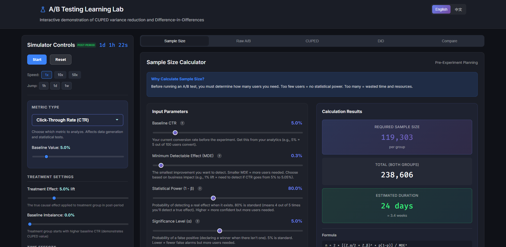

# A/B Testing Interactive Learning Lab

An interactive web application that teaches A/B testing concepts through real-time simulated streaming events. Learn how **CUPED** reduces variance and **Difference-in-Differences (DiD)** removes confounding time effects—all with visual, step-by-step explanations.



## Quick Start

```bash
# Install dependencies
npm install

# Start development server
npm run dev

# Open http://localhost:5173
```

## Features

### � Multi-Language Support
- **English / 中文** language toggle in the header
- All UI elements, tooltips, and explanations fully translated

### ❓ Interactive Help Tooltips
- **Question mark icons** next to every statistical parameter
- Hover to see **step-by-step instructions** for how to calculate each metric in real work
- Perfect for learning the practical workflow of A/B testing

### 🧮 Sample Size Calculator (Pre-Experiment Planning)
- **Baseline CTR** - your current conversion rate
- **Minimum Detectable Effect (MDE)** - smallest lift worth detecting
- **Statistical Power** - typically 80%
- **Significance Level** - typically 5%
- **Daily Traffic & Allocation** - estimate experiment duration
- **Best practice recommendations** included

### �🎛️ Interactive Simulation
- **Streaming events**: Watch user interactions (impressions and clicks) stream in real-time
- **Configurable parameters**: Adjust treatment effect, baseline imbalance, time trends, and noise
- **Pre/Post periods**: See how the experiment progresses from pre-period to post-period
- **Export data**: Download simulation data as CSV or JSON

### 📊 Raw A/B Testing
- Naive post-period comparison of CTR between groups
- Confidence intervals and p-values
- **Warning system**: Detects when baseline imbalance may bias results

### 🎯 CUPED (Controlled-experiment Using Pre-Experiment Data)
**What CUPED demonstrates:**
- Uses pre-period behavior to reduce variance in estimates
- Formula: `Y_adj = Y - θ × (X - X̄)` where θ = Cov(Y,X) / Var(X)
- **Step-by-step walkthrough** of the calculation
- **Scatter plot** showing correlation between pre and post metrics
- **Variance reduction indicator**: See how much tighter your estimates become

**Why it matters:** CUPED can reduce variance by 30-50%, meaning you need less traffic (or time) to detect the same effect!

### 📈 Difference-in-Differences (DiD)
**What DiD demonstrates:**
- Removes global time effects that affect both groups
- Formula: `DiD = (Treat_post - Treat_pre) - (Ctrl_post - Ctrl_pre)`
- **2×2 table** showing the calculation
- **Time-series chart** with visual launch line
- **Regression interpretation**: Y = α + β₁×Treat + β₂×Post + β₃×(Treat×Post)

**Why it matters:** When seasonality or trends affect CTR over time, naive A/B tests give wrong answers. DiD corrects for this!

### ⚖️ Method Comparison
- Side-by-side comparison of all three methods
- **Sanity checks**: SRM, pre-period balance, parallel trends
- Guidance on when to use each method

## Suggested Experiments

Try these configurations to see the methods differ:

### 1. Baseline Imbalance
- Set **Baseline Imbalance** to 20%
- Run the simulation
- **Observe**: Naive A/B shows inflated effect, CUPED corrects it

### 2. Time Trend
- Set **Time Trend** to 30% per minute
- Set **Treatment Effect** to 5%
- **Observe**: Naive A/B confuses trend with treatment, DiD isolates the true effect

### 3. Combined Challenges
- Enable both imbalance (15%) and time trend (20%)
- Compare all three methods
- **Observe**: Only CUPED and DiD give accurate estimates

### 4. Power Comparison
- With moderate imbalance, observe CUPED's tighter confidence intervals
- Note how it achieves significance faster than naive A/B

## Project Structure

```
src/
├── simulation/          # Event generation & user modeling
│   ├── types.ts        # TypeScript interfaces
│   ├── userGenerator.ts # User pool with beta/lognormal distributions
│   └── eventEmitter.ts  # Streaming event generation
├── stats/               # Statistical calculations
│   ├── utils.ts        # Mean, variance, CI, p-value helpers
│   ├── naiveAB.ts      # Simple A/B test
│   ├── cuped.ts        # CUPED implementation
│   └── did.ts          # DiD implementation
├── hooks/
│   └── useSimulation.ts # Central state management hook
├── i18n/                # Internationalization
│   ├── translations.ts # EN/ZH translations
│   ├── LanguageContext.tsx # React context for language
│   └── index.ts        # Module exports
├── components/          # React UI components
│   ├── ControlPanel.*   # Simulation controls
│   ├── LiveStream.*     # Event log & counters
│   ├── SampleSizePanel.* # Pre-experiment calculator
│   ├── RawABPanel.*     # Naive comparison
│   ├── CupedPanel.*     # CUPED walkthrough
│   ├── DidPanel.*       # DiD walkthrough
│   ├── ComparePanel.*   # Method comparison
│   ├── Tooltip.*        # Help tooltip components
│   └── LanguageSwitch.* # EN/ZH toggle
└── App.tsx              # Main application
```

## Tech Stack

- **Frontend**: React + TypeScript (Vite)
- **Charts**: Recharts
- **Statistics**: Custom implementations (no external dependencies)
- **i18n**: Custom React Context-based solution
- **Styling**: CSS with modern dark theme

## Statistical Details

### Naive A/B Test
```
Effect = CTR_treatment - CTR_control
SE = sqrt(p1*(1-p1)/n1 + p2*(1-p2)/n2)
```

### CUPED
```
Y_adj = Y - θ × (X - μ_X)
θ = Cov(Y, X) / Var(X)
Variance reduction = 1 - Var(Y_adj) / Var(Y)
```

### Difference-in-Differences
```
DiD = (Treat_post - Treat_pre) - (Ctrl_post - Ctrl_pre)
     = β₃ in regression: Y = α + β₁×Treat + β₂×Post + β₃×(Treat×Post)
```

### Sample Size
```
n = 2 × [(Z_α/2 + Z_β)² × p(1-p)] / MDE²
Duration = (2 × n) / (Daily_Traffic × Allocation)
```

## License

MIT
